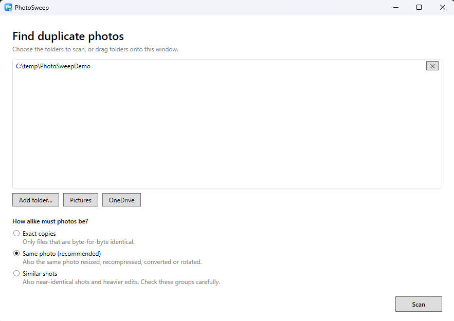
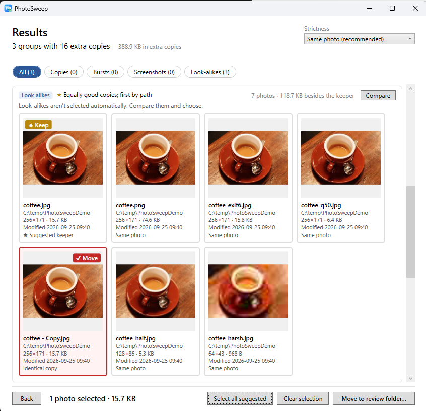
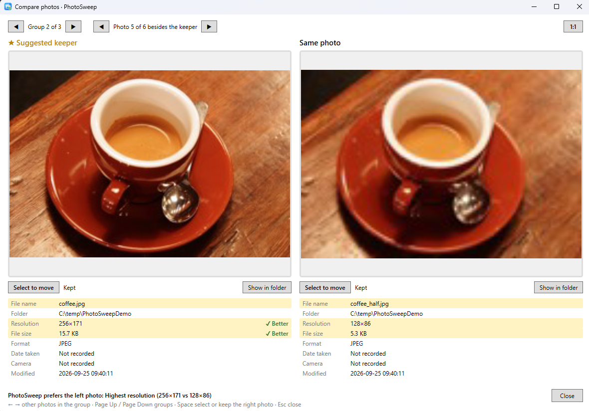
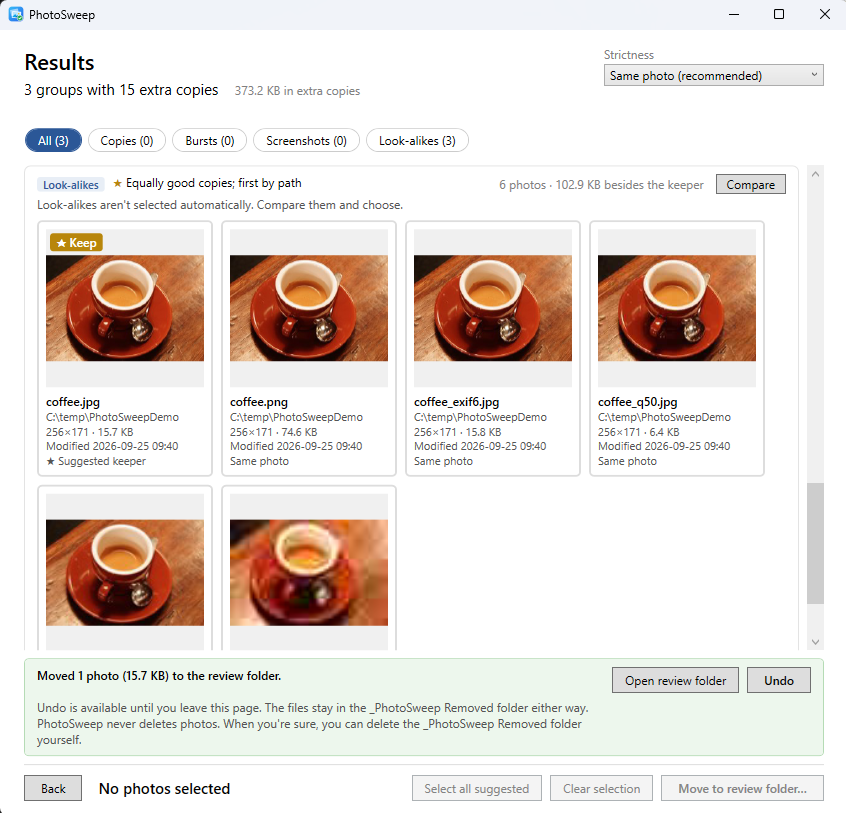
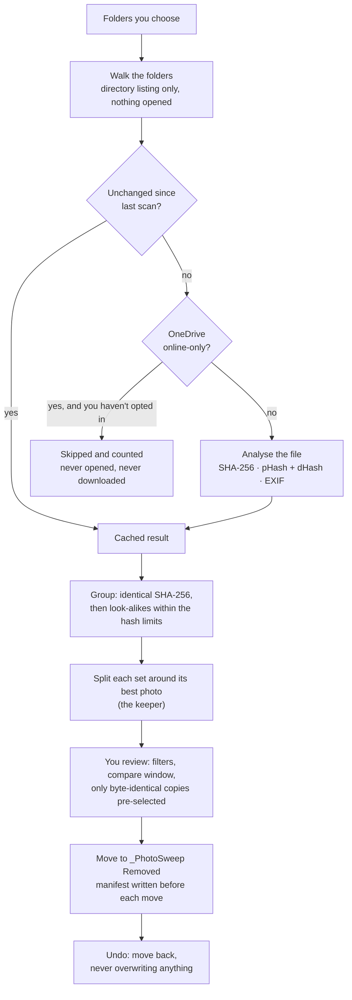
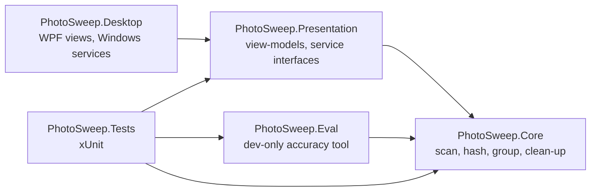

<p align="center"></p>

# PhotoSweep

[](https://github.com/Angada28/PhotoSweep/actions/workflows/ci.yml)

PhotoSweep is a Windows desktop app that finds duplicate and look-alike photos and helps you clean them up safely.
It never deletes anything: photos you remove are moved into a review folder, and every clean-up can be undone.

It's for anyone whose photo library has grown copies over the years: phone backups imported twice, the same
pictures in OneDrive and in a Google Takeout export, resized copies sent through messaging apps, burst shots.
It runs entirely on your PC. There's no account, no upload and no network access.

<!--
  Screenshots to add (taken with the repo's test photos only, tests/PhotoSweep.Tests/TestData/Photos):
  
  
  
  
-->

## Features

- **Three strictness levels.** *Exact copies* (byte-for-byte identical), *Same photo* (also resized, recompressed,
  converted or rotated copies; the default) and *Similar shots* (also near-identical shots and heavier edits).
- **Suggested keeper in every group**, ranked by resolution, camera data, file name, file size and age, with the
  reason shown ("Highest resolution (4032×3024 vs 1600×1200)", "Has camera data", …).
- **Only true copies are pre-selected.** Byte-identical copies are ticked for you; look-alikes never are
  ([why](#why-only-byte-identical-copies-are-pre-selected)).
- **Group kinds and filters**: Copies, Burst, Screenshots and Look-alikes, with a count on each filter.
- **Compare window**: two photos side by side with synced zoom and pan, 1:1 view, and a details table that marks
  which photo is better on each point.
- **Safe clean-up**: selected photos are moved to a `_PhotoSweep Removed` folder with a manifest, and **Undo** puts
  them back.
- **OneDrive-aware**: online-only files are detected and never downloaded unless you choose to.
- **Fast re-scans**: results are cached per file (by size and last-write time), so a second scan of a large library
  takes seconds.
- **Formats**: JPEG, PNG, BMP, GIF, TIFF and WebP. HEIC/HEIF files are matched as exact copies only (see
  [Limitations](#limitations)).
- Google Takeout `.json` metadata files move with their photo and come back on undo.

## Download and run

1. Download **PhotoSweep.exe** and **PhotoSweep.exe.sha256** from the
   [latest release](https://github.com/Angada28/PhotoSweep/releases/latest).
2. Run `PhotoSweep.exe`. There's no installer, and .NET doesn't need to be installed: the exe is self-contained,
   which is why it's large (about 140 MB). It needs Windows 10 or 11, 64-bit.

**The exe isn't code-signed.** Signing certificates cost money, and this is a personal project. So the first time you
run it, Windows SmartScreen may say *"Windows protected your PC"* (choose **More info**, then **Run anyway**), and some
antivirus tools may flag it as unknown. To check that your download is exactly the file the
[release workflow](.github/workflows/release.yml) built from this source, compare its SHA-256 with the published one:

```powershell
$expected = (Get-Content .\PhotoSweep.exe.sha256).Split(' ')[0]
(Get-FileHash .\PhotoSweep.exe -Algorithm SHA256).Hash -eq $expected   # True if it matches
```

The hash is also printed in the release notes.

**What it writes, and where:** a scan cache in `%LOCALAPPDATA%\PhotoSweep\scan-cache.json`, and a
`_PhotoSweep Removed` folder inside each scanned folder once you move something. To uninstall, delete the exe and
that cache folder.

## Build and test from source

Requirements: Windows, and the [.NET 10 SDK](https://dotnet.microsoft.com/download/dotnet/10.0), 10.0.401 or later
(pinned in [`global.json`](global.json)).

```powershell
git clone https://github.com/Angada28/PhotoSweep.git
cd PhotoSweep
dotnet build PhotoSweep.sln
dotnet test PhotoSweep.sln
dotnet run --project src/PhotoSweep.Desktop
```

To build the same single-file exe as a release:

```powershell
dotnet publish src/PhotoSweep.Desktop -c Release -r win-x64 -o publish
```

The version number lives in [`Directory.Build.props`](Directory.Build.props). Pushing a tag `v<that version>` runs
the release workflow, which builds, tests, publishes and attaches the exe and its checksum to a GitHub Release.
Every push and pull request runs [CI](.github/workflows/ci.yml): build with warnings as errors, then all tests.

Generated assets can be regenerated with their scripts: `dotnet run tools/GenerateTestImages.cs` (test photos) and
`dotnet run tools/GenerateIcon.cs` (app icon).

## How it works



1. **Scan.** One thread walks the folders into a bounded channel while several workers analyse files in parallel,
   so analysis starts on the first file found. Each file gets a SHA-256 (exact copies), two 64-bit perceptual hashes
   (pHash from a DCT of a 32×32 thumbnail, dHash from brightness gradients; look-alikes), and the EXIF details used
   for ranking. All decoding is done by [ImageSharp](https://github.com/SixLabors/ImageSharp).
2. **Group.** Byte-identical files are grouped first. Then every pair of distinct photos is compared: two photos
   match only if **both** hash distances are within the level's limits (pHash ≤ 4 and dHash ≤ 5 for *Same photo*),
   and, at *Same photo*, their EXIF capture times don't differ.
3. **Pick a keeper.** Matching isn't transitive (burst frame 1 matches 2, and 2 matches 3, but 1 and 3 can be far
   apart), so each connected set is split: the best-ranked photo becomes the keeper and takes only the photos that
   match *it*, and the rest are split the same way.
4. **Clean up and undo.** See [Safety guarantees](#safety-guarantees).

### Project layering



- **Core** (`net10.0`) is the domain logic and knows nothing about UI.
- **Presentation** (`net10.0`, MVVM with CommunityToolkit.Mvvm) holds the view-models. It targets plain `net10.0`,
  so it *can't* reference WPF. Anything OS-specific (folder picker, Explorer, windows, image previews) is an
  interface here, implemented in Desktop.
- **Desktop** (`net10.0-windows`) is the only WPF project: XAML views with no logic in code-behind, plus the Windows
  implementations of those interfaces.
- **Tests** cover Core, Presentation and Eval with fakes for the interfaces, so they run without WPF. An architecture
  test fails the build if Core or Presentation ever references a UI framework.

### Key design decisions

The full reasoning, with the evidence and what would make each one change, is in
[docs/decisions.md](docs/decisions.md). The main ones:

- [Only byte-identical copies are pre-selected; *Same photo* is pHash ≤ 4, dHash ≤ 5](docs/decisions.md#2026-09-26-samephoto-becomes-phash--4-dhash--5-only-byte-identical-copies-are-pre-selected)
- [Group kinds, the capture-time rule, animated images and Takeout sidecars](docs/decisions.md#2026-09-26-review-aids-group-kinds-capture-time-rule-animated-gifs-n-names-takeout-sidecars)
- [Write-ahead manifest, no-copy moves, no recursive deletes](docs/decisions.md#2026-09-25-clean-up-writes-the-manifest-before-each-move-moves-without-copying-and-never-deletes-recursively)
- [Groups are split around a keeper, not taken whole from union-find](docs/decisions.md#2026-09-25-groups-are-split-around-a-keeper-not-taken-whole-from-union-find)
- [Look-alike search is brute force, not a BK-tree](docs/decisions.md#2026-09-25-look-alike-search-is-brute-force-not-a-bk-tree)
- [Thumbnails through ImageSharp, with two online-only checks](docs/decisions.md#2026-09-25-results-page-thumbnails-imagesharp-checked-for-cloud-files-twice-settle-delay-before-decoding)

## Evaluation

The match limits were chosen by measurement, with the dev-only tool in [`tools/PhotoSweep.Eval`](tools/PhotoSweep.Eval/README.md).
All numbers below are from [docs/decisions.md](docs/decisions.md#2026-09-26-samephoto-becomes-phash--4-dhash--5-only-byte-identical-copies-are-pre-selected).
They come from one personal library of about 9,000 photos (a Google Takeout export), which isn't included in this repo.

### Recall and false positives (synthetic)

300 photos were sampled from the library, and each was saved as 7 variants: resized to 50% and 25%, JPEG quality 50 and 30,
converted to PNG, rotated via EXIF orientation, and 50% + quality 30 combined. That gives 2,100 variants to find, and
44,850 pairs of different originals that should *not* match.

| Limits (pHash ≤ / dHash ≤) | Recall: variants matched to their original | "False positives" among 44,850 pairs |
|---|---:|---:|
| 4 / 4 | 97.8% | 1 |
| **4 / 5 (shipped)** | **99.3%** | **1** |
| 4 / 8 | 99.7% | 2 |
| 8 / 8 (previous) | 99.9% | 3 |
| 14 / 14 | 100% | 11 |

**The "false positives" are not unrelated photos colliding.** Every one of the 11 pairs at 14/14 is a real
near-duplicate that was already in the library as two separate files: burst frames, app screenshots of the same
screen, a burst's cover image, two shots taken seconds apart. The single pair at the shipped limits is two frames of a
burst. For genuinely different photos, the closest pairs are about 24 bits apart (5th percentile), far outside any
limit PhotoSweep uses. So the hash limits reliably keep unrelated photos apart, but they can't tell a burst frame or a
near-identical screenshot from a copy. That's the job of the precision measurement below.

### Precision on real groups (hand-labelled)

The library was grouped at the old 8/8 limits, and 30 keeper–member pairs were drawn at random from each distance
bucket, 120 in all. Each pair was labelled by eye, with a strict rule: "same" only if there is no visible difference
at all. Byte-identical copies were left out, as they are trivially the same.

| Hash distance (larger of pHash and dHash) | Labelled | Same picture | Precision | 95% CI |
|---|---:|---:|---:|---|
| 0–2 | 30 | 18 | 60.0% | 42–75% |
| 3–4 | 30 | 7 | 23.3% | 12–41% |
| 5–6 | 30 | 12 | 40.0% | 25–58% |
| 7–8 | 30 | 2 | 6.7% | 2–21% |

Weighted by how common each bucket is, precision is **40.2% (29–53%) at ≤ 4**, and 28.8% at ≤ 8. Adding the
capture-time rule (photos taken a second or more apart aren't *Same photo*) raises it to 49.6% at ≤ 4, but the 95%
intervals overlap, so that gain isn't established on this sample. The "different" pairs were things a 64-bit hash of
a small thumbnail can't see: burst frames a moment apart, clock digits and notifications on screenshots, stickers and
small edits.

This library is a **worst case for precision**: its real duplicates had already been removed before export, so what
remains is mostly near-misses. A library with real copies would score higher. Recall doesn't depend on this, because
it's measured on generated copies. The sample is small (120 pairs, one library), which is why the intervals are wide.

### Why only byte-identical copies are pre-selected

Even the closest look-alikes were the same picture only about 60% of the time. Pre-selecting them would put roughly
4 wrong suggestions in 10 in front of you, and one careless "Move" would remove a photo you wanted. A byte-identical
copy is the only case where removing it can't lose anything. So PhotoSweep still **groups** look-alikes, because
grouping costs nothing, but you decide which to remove, with the compare window to help.

## Safety guarantees

- **Nothing is ever deleted.** Clean-up *moves* photos into `_PhotoSweep Removed\<date and time>\` inside the scanned
  folder, keeping their subfolders. You empty that folder yourself once you're happy. PhotoSweep never deletes a photo
  anywhere.
- **Every batch can be undone.** Each move is recorded in a manifest *before* the file moves (write-ahead), so even a
  crash mid-move can't lose track of a file. **Undo** moves photos back, and never overwrites: if something new now
  sits at the original path, the photo comes back alongside it as `name (2).jpg`.
- **Moves are renames, never copies.** A move that Windows would have to turn into a copy (to another drive) is
  refused and reported instead, so a file is never read or duplicated during clean-up.
- **You can never remove every copy.** A group always keeps at least one photo, and just before moving, PhotoSweep
  checks again that a kept copy still exists unchanged on disk. Photos that changed since the scan are skipped.
- **OneDrive online-only files are never downloaded without asking.** Opening an online-only file makes Windows
  download it. PhotoSweep recognises these files from the directory listing, without opening them, skips them, and
  tells you how many there are and how much they'd download. They're read only if you choose **Download and scan them too**.
  Thumbnails, previews and clean-up follow the same rule, and moving or undoing an online-only file never downloads it.
- **Folders are only removed when empty.** After a full undo, the batch's empty folders are removed with
  non-recursive deletes, which Windows refuses if anything is still inside.

## Limitations

- **Windows only**, 64-bit. The UI is WPF.
- **Unsigned exe**, so SmartScreen and antivirus warnings are likely on first run (see [Download and run](#download-and-run)).
- **Look-alikes need a human.** Hashes can't tell burst frames, near-identical screenshots or small edits from true
  copies, so those groups always need checking. *Similar shots* (limits 14/14) hasn't had its own measurement yet.
- **HEIC/HEIF**: ImageSharp can't decode these, so they're found as exact copies only, with no look-alike matching
  and no preview.
- **Animated images and multi-page TIFFs are matched as exact copies only.** This covers animated GIFs, animated PNGs
  (APNG), animated WebPs and multi-page TIFFs: a burst's cover animation hashes like one of its stills but is a
  different file to keep. Ordinary single-frame GIF, PNG, WebP and TIFF files get full look-alike matching like any
  other photo.
- **Undo covers the current results page only.** After you leave it, earlier batches are still in
  `_PhotoSweep Removed` with their manifests, but restoring them from the app isn't built yet.
- **Accuracy was measured on one library.** The numbers above come from a single, unusually hard library and a
  120-pair hand-labelled sample.
- **Scale.** The look-alike comparison is brute force (every pair). It takes well under a second for about 17,000
  photos but grows with the square of the library size.

## Licence

[MIT](LICENSE) © 2026 Angad Harish
